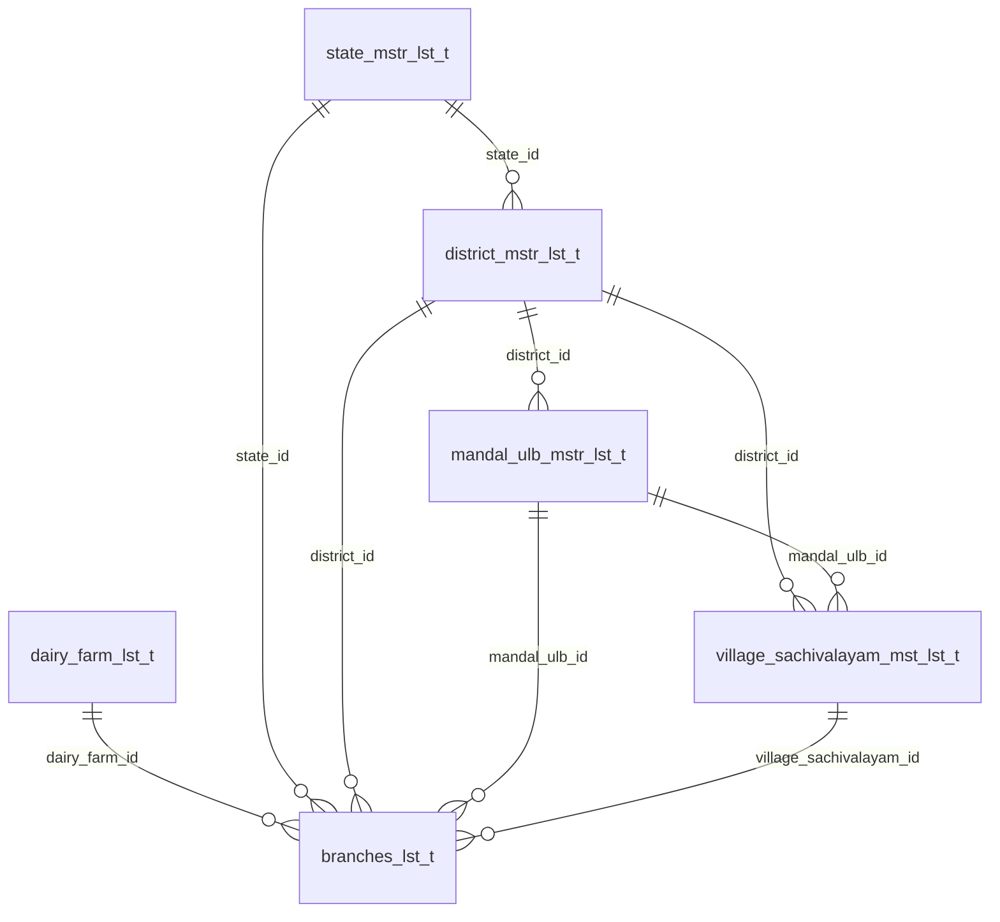
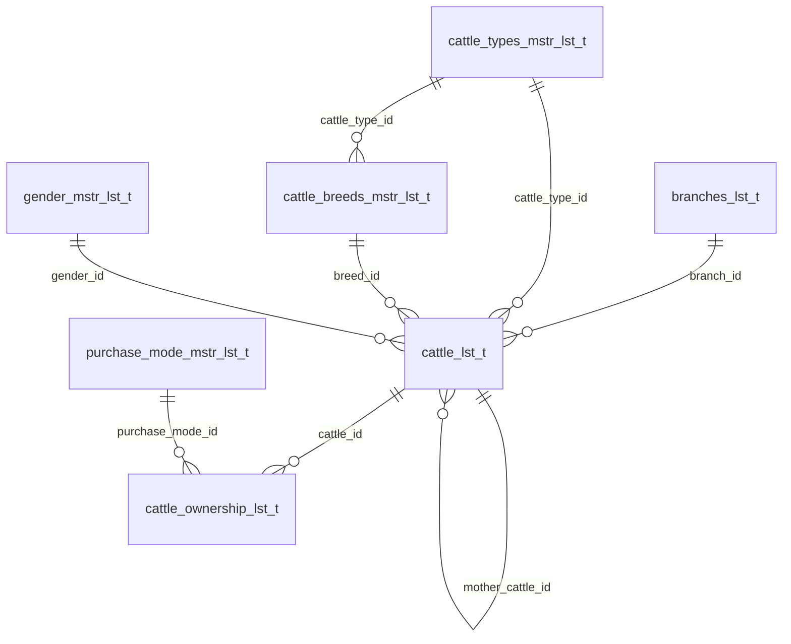
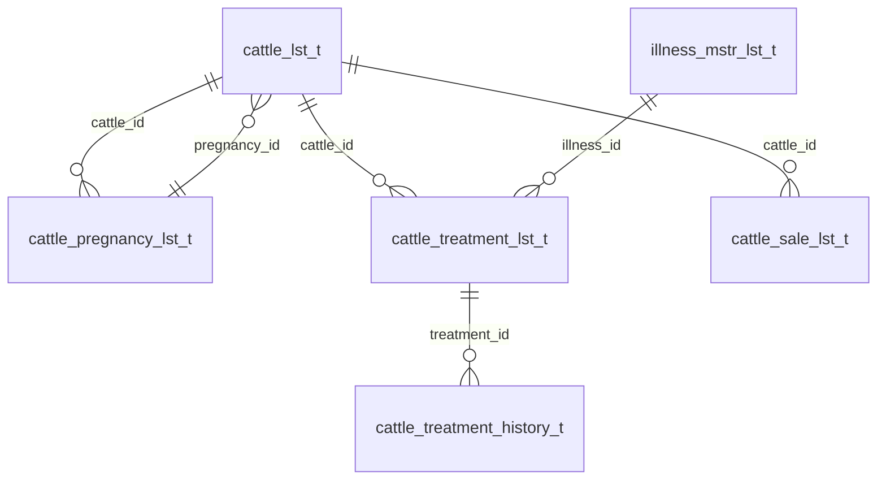
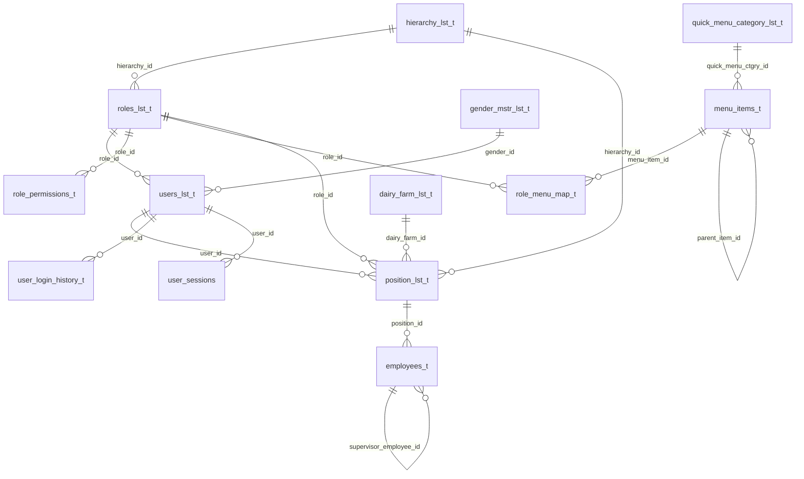
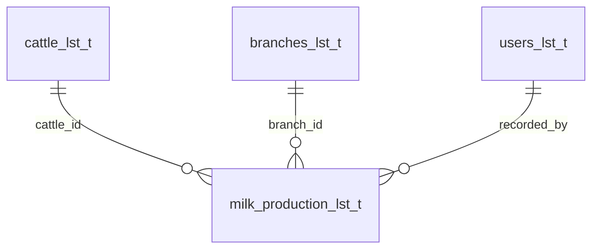

# milk-nest data model

How the tables reference each other. Generated by reading `information_schema` on the live schema,
not from memory — every arrow below is a real foreign key unless the section says otherwise.

**33 base tables, 42 foreign keys.**

## How to read this

- `child.column -> parent.column` means the child row points at one parent row.
- The Mermaid blocks render as diagrams on GitHub. In VS Code you need a Mermaid preview
  extension; the arrow lists underneath say the same thing in plain text.
- `||--o{` is "one parent, many children". `}o--||` is the same relationship read the other way.

## The spine, in one paragraph

Everything hangs off **branches**. A branch belongs to a dairy farm *and* carries a denormalised
copy of the whole location chain — state, district, mandal, village. That is not redundancy for its
own sake: it is what lets row-level access control restrict any query with a single indexed equality
(see [Access scoping](#access-scoping) below). Cattle belong to a branch. Everything about an animal
— her milk, her pregnancies, her illnesses, her ownership, her sale — hangs off the cattle row.

```
location masters -> dairy farm -> branch -> cattle -> {milk, pregnancy, treatment, ownership, sale}
```

---

## 1. Location and organisation



```
district_mstr_lst_t.state_id                    -> state_mstr_lst_t.state_id
mandal_ulb_mstr_lst_t.district_id               -> district_mstr_lst_t.district_id
village_sachivalayam_mst_lst_t.district_id      -> district_mstr_lst_t.district_id
village_sachivalayam_mst_lst_t.mandal_ulb_id    -> mandal_ulb_mstr_lst_t.mandal_ulb_id
branches_lst_t.dairy_farm_id                    -> dairy_farm_lst_t.dairy_farm_id
branches_lst_t.state_id                         -> state_mstr_lst_t.state_id
branches_lst_t.district_id                      -> district_mstr_lst_t.district_id
branches_lst_t.mandal_ulb_id                    -> mandal_ulb_mstr_lst_t.mandal_ulb_id
branches_lst_t.village_sachivalayam_id          -> village_sachivalayam_mst_lst_t.village_sachivalayam_id
```

`branches_lst_t` holds all four location ids at once. A village already implies its mandal, district
and state, so those columns are derivable — they are stored anyway so that scoping at any level is
one equality on an indexed column rather than a chain of joins.

---

## 2. Cattle core



```
cattle_lst_t.branch_id                 -> branches_lst_t.branch_id
cattle_lst_t.cattle_type_id            -> cattle_types_mstr_lst_t.cattle_type_id
cattle_lst_t.breed_id                  -> cattle_breeds_mstr_lst_t.breed_id
cattle_lst_t.gender_id                 -> gender_mstr_lst_t.gender_id
cattle_lst_t.mother_cattle_id          -> cattle_lst_t.cattle_id            (self: calf -> dam)
cattle_breeds_mstr_lst_t.cattle_type_id-> cattle_types_mstr_lst_t.cattle_type_id
cattle_ownership_lst_t.cattle_id       -> cattle_lst_t.cattle_id
cattle_ownership_lst_t.purchase_mode_id-> purchase_mode_mstr_lst_t.purchase_mode_id
```

**Type and breed both hang off the cattle row**, even though breed already implies type. That is
deliberate: the breeding rules (`gestation_days`, `expected_dry_off_days`) exist on *both* masters,
and the breed value wins with the type as fallback —
`ifnull(breed.gestation_days, type.gestation_days)`. So an animal needs both to resolve its rule.

**Ownership is a history table, not a column.** A farm may hold an animal under a partnership and
later buy it outright, so ownership is one row per arrangement with `effective_from` / `effective_to`.
The current arrangement is the row where `effective_to is null`.

---

## 3. Cattle lifecycle



```
cattle_pregnancy_lst_t.cattle_id        -> cattle_lst_t.cattle_id        (pregnancy -> the dam)
cattle_lst_t.pregnancy_id               -> cattle_pregnancy_lst_t.pregnancy_id  (calf -> the calving it came from)
cattle_treatment_lst_t.cattle_id        -> cattle_lst_t.cattle_id
cattle_treatment_lst_t.illness_id       -> illness_mstr_lst_t.illness_id
cattle_treatment_history_t.treatment_id -> cattle_treatment_lst_t.treatment_id
cattle_sale_lst_t.cattle_id             -> cattle_lst_t.cattle_id
```

### The cattle ↔ pregnancy cycle

These two tables point at each other, which looks wrong at a glance. They are two different facts:

- `cattle_pregnancy_lst_t.cattle_id` — **whose** pregnancy this is (the mother).
- `cattle_lst_t.pregnancy_id` — **which calving produced** this animal (only set on calves).

So a cow has many pregnancies, and a pregnancy produces zero or more calves, each of which is its
own `cattle_lst_t` row carrying that `pregnancy_id`. Twins are simply two rows with the same
`pregnancy_id` — which makes "the calves from this calving" a single indexed lookup. A calf therefore
points back at its dam twice, once directly (`mother_cattle_id`) and once through the pregnancy.

### Episode and visit

`cattle_treatment_lst_t` is the **illness episode** ("mastitis from the 3rd"), and
`cattle_treatment_history_t` is **one visit inside it**. The episode owns the illness, the dates and
the milk withdrawal period; each visit owns its medicines, observation and cost. The episode's
`total_expense` is derived from its visits, never incremented.

### `cattle_sale_lst_t` has no module yet

The table and its FK exist, but nothing reads or writes it. Selling an animal is currently expressed
only by `cattle_lst_t.cattle_status`, which the eligibility rules treat as "gone from the herd".

---

## 4. Identity, roles and menus



```
roles_lst_t.hierarchy_id            -> hierarchy_lst_t.hirrarchy_id     (note the spelling)
users_lst_t.role_id                 -> roles_lst_t.role_id
users_lst_t.gender_id               -> gender_mstr_lst_t.gender_id
role_permissions_t.role_id          -> roles_lst_t.role_id
role_menu_map_t.role_id             -> roles_lst_t.role_id              [ON DELETE CASCADE]
role_menu_map_t.menu_item_id        -> menu_items_t.menu_item_id        [ON DELETE CASCADE]
menu_items_t.parent_item_id         -> menu_items_t.menu_item_id        [ON DELETE SET NULL]
menu_items_t.quick_menu_ctgry_id    -> quick_menu_category_lst_t.quick_menu_ctgry_id
position_lst_t.user_id              -> users_lst_t.user_id
position_lst_t.role_id              -> roles_lst_t.role_id
position_lst_t.hierarchy_id         -> hierarchy_lst_t.hirrarchy_id
position_lst_t.dairy_farm_id        -> dairy_farm_lst_t.dairy_farm_id
user_login_history_t.user_id        -> users_lst_t.user_id
user_sessions.user_id               -> users_lst_t.user_id
employees_t.position_id             -> position_lst_t.position_id
employees_t.supervisor_employee_id  -> employees_t.employee_id          (self)
```

Three things worth knowing:

- **`role_permissions_t` is keyed by a string, not a foreign key.** Its `permission_key` column
  (`cattle`, `cattle-lyfecycle`, `milk-production`, `users`, …) is matched against a literal in the
  route definition. Nothing in the database validates it, so a typo in either place silently denies
  access. The columns are `can_view`, `can_update`, `can_insert`, `can_delete`.
- **`role_menu_map_t.display_order` is what orders the sidebar**, per role. `menu_items_t` has no
  ordering column of its own.
- **`employees_t` is empty and unused.** `users_lst_t.employee_id` exists but has no FK.

### Access scoping

`position_lst_t` is where a user's reach is defined: it carries the same location spine as a branch
but names the branch column `location_ref_id`. At login, the user's `hierarchy_level` and
`hierarchy_key` are derived from it and signed into the JWT. `scope.utils.getScopeFilter` then turns
that pair into one condition:

| hierarchy_level | branch column used | position column used |
|---|---|---|
| `super_admin` | *(no restriction)* | — |
| `dairy_form` | `dairy_farm_id` | `dairy_farm_id` |
| `form_branch` | `branch_id` | `location_ref_id` |
| `village` / `mandal` / `district` | matching id column | matching id column |
| `state` | `state_id` | *(none — fails closed)* |

Anything unrecognised produces `and 1 = 0` — no rows, never all rows.

---

## 5. Operations and cross-cutting



```
milk_production_lst_t.cattle_id   -> cattle_lst_t.cattle_id
milk_production_lst_t.branch_id   -> branches_lst_t.branch_id
milk_production_lst_t.recorded_by -> users_lst_t.user_id
```

`milk_production_lst_t.branch_id` duplicates what `cattle_lst_t.branch_id` already says. It is kept
so the day sheet and every report can filter and scope by branch without joining through cattle.

**Tables with no foreign keys at all** — deliberately detached, because an audit trail that
cascades away with its subject is not an audit trail:

| Table | Holds | Links by |
|---|---|---|
| `audit_logs_t` | who changed what, with old values | `entity_id` + entity name, as plain values |
| `email_audit_logs_t` | every email sent | no link |
| `uploaded_files_lst_t` | upload history | `entity_id` + `uploaded_by`, as plain values |
| `master_versions_t` | master-data cache versioning | no link (empty) |
| `sessions` | the express-session store (`session_id`, `expires`, `data`) | `user_sessions.session_id` matches it, without a FK |

---

## Complete reference

### Every foreign key, by parent

| Parent table | Children pointing at it |
|---|---|
| `cattle_lst_t` | `cattle_lst_t.mother_cattle_id`, `cattle_ownership_lst_t`, `cattle_pregnancy_lst_t`, `cattle_sale_lst_t`, `cattle_treatment_lst_t`, `milk_production_lst_t` |
| `branches_lst_t` | `cattle_lst_t`, `milk_production_lst_t` |
| `dairy_farm_lst_t` | `branches_lst_t`, `position_lst_t` |
| `users_lst_t` | `milk_production_lst_t.recorded_by`, `position_lst_t`, `user_login_history_t`, `user_sessions` |
| `roles_lst_t` | `users_lst_t`, `position_lst_t`, `role_permissions_t`, `role_menu_map_t` |
| `hierarchy_lst_t` | `roles_lst_t`, `position_lst_t` |
| `menu_items_t` | `menu_items_t.parent_item_id`, `role_menu_map_t` |
| `gender_mstr_lst_t` | `cattle_lst_t`, `users_lst_t` |
| `cattle_types_mstr_lst_t` | `cattle_breeds_mstr_lst_t`, `cattle_lst_t` |
| `cattle_breeds_mstr_lst_t` | `cattle_lst_t` |
| `illness_mstr_lst_t` | `cattle_treatment_lst_t` |
| `purchase_mode_mstr_lst_t` | `cattle_ownership_lst_t` |
| `cattle_treatment_lst_t` | `cattle_treatment_history_t` |
| `cattle_pregnancy_lst_t` | `cattle_lst_t.pregnancy_id` |
| `quick_menu_category_lst_t` | `menu_items_t` |
| `position_lst_t` | `employees_t` |
| `employees_t` | `employees_t.supervisor_employee_id` |
| `state_mstr_lst_t` | `district_mstr_lst_t`, `branches_lst_t` |
| `district_mstr_lst_t` | `mandal_ulb_mstr_lst_t`, `village_sachivalayam_mst_lst_t`, `branches_lst_t` |
| `mandal_ulb_mstr_lst_t` | `village_sachivalayam_mst_lst_t`, `branches_lst_t` |
| `village_sachivalayam_mst_lst_t` | `branches_lst_t` |

### Delete behaviour

39 of the 42 foreign keys are `ON DELETE NO ACTION` — the default, meaning a parent with children
cannot be deleted. The three exceptions:

```
role_menu_map_t.role_id        -> roles_lst_t            ON DELETE CASCADE
role_menu_map_t.menu_item_id   -> menu_items_t           ON DELETE CASCADE
menu_items_t.parent_item_id    -> menu_items_t           ON DELETE SET NULL
```

---

## Two things the diagram cannot show

### Soft deletes mean the foreign keys do not protect you

Almost every table has `is_active`, `deleted_by`, `deleted_time`, and "deleting" a record sets
`is_active = 0`. The row stays, so **the foreign key is still satisfied** and the database raises
nothing. A soft-deleted illness still has treatments pointing at it; a soft-deleted pregnancy still
has calves.

That is why every delete path has a **count guard in its service**, written per function rather than
centralised, so the message can say what is in the way and what to do instead:

```
deletePregnancySrvc  -> countCalvesByPregnancyMdl      "N calf record(s) are registered against it"
deleteTreatmentSrvc  -> countCheckupsByTreatmentMdl    "N checkup(s) recorded against it"
```

Anything reading these tables must filter `is_active = 1` itself. The database will not do it.

### `created_by` / `updated_by` / `deleted_by` are user ids with no foreign key

They appear on nearly every table and all hold `users_lst_t.user_id`, but none is an enforced FK.
That is intentional — a user record should be removable without rewriting history — but it means a
join to `users_lst_t` on those columns can come back empty, and nothing stops a bad value.

`cattle_treatment_lst_t.attended_by` and `cattle_treatment_history_t.attended_by` are **not** user
ids at all, despite the `_by` suffix: they are free text, because the vet is usually not a system
user.

## Known gaps

- **`position_lst_t` location columns have no foreign keys** — `district_id`, `mandal_ulb_id`,
  `village_sachivalayam_id`, `location_ref_id`, `assigned_employee_id`. Since these drive access
  scoping, a wrong value silently changes what a user can see rather than failing.
- **`hierarchy_lst_t.parent_hirrarchy_id`** is a self-reference with no FK, and the column is spelled
  `hirrarchy_id` while every referencing column is spelled `hierarchy_id`.
- **`cattle_breeds_mstr_lst_t.gestation_days` and `expected_dry_off_days` are NULL for all 11 breeds**,
  so every animal currently falls back to its type's value (Cow 283/120, Buffalo 310/120). The
  breed-overrides-type path works but no data exercises it.
- **`cattle_sale_lst_t`** has no service, controller or screen.
- **`employees_t`** is empty; `users_lst_t.employee_id` is unenforced.
